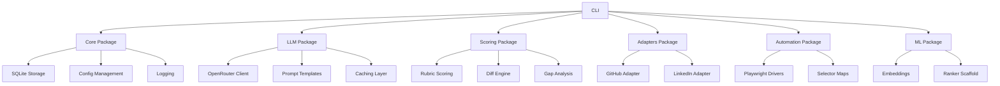

# Architecture Overview

## System Components



## Data Flow

1. **User Interaction**: User runs CLI commands to initiate actions
2. **Fact Store**: User facts and artifacts are stored in SQLite
3. **Scoring**: Current profiles are analyzed and scored against rubrics
4. **Planning**: Edit plans are generated based on gap analysis
5. **Execution**: Adapters and automation apply changes to platforms
6. **Learning**: Continuous learning updates the knowledge base

## Core Principles

- **Local-first**: All data stored locally, no cloud dependency
- **Safety-first**: Manual login, run approval, stop-before-submit
- **Modular**: Clear separation of concerns between packages
- **Extensible**: Pluggable architecture for future enhancements

## Key Data Structures

### UserFactStore
```typescript
interface UserFactStore {
  id: string;
  version: string;
  createdAt: string;
  updatedAt: string;
  personal: PersonalFacts;
  career: CareerFacts;
  projects: ProjectFact[];
  skills: SkillFact[];
  education: EducationFact[];
}
```

### ArtifactGraph
```typescript
interface ArtifactGraph {
  nodes: ArtifactNode[];
  edges: ArtifactEdge[];
}
```

### EditPlan
```typescript
interface EditPlan {
  version: string;
  generatedAt: string;
  currentScores: ScoreSet;
  targetScores: ScoreSet;
  actions: EditAction[];
}
```

## Package Responsibilities

### Core Package
- Configuration management
- SQLite storage layer
- Logging infrastructure
- Scheduler for continuous learning

### LLM Package
- OpenRouter client implementation
- Prompt template management
- Request caching
- Structured output validation

### Scoring Package
- Rubric-based scoring
- Gap analysis
- Diff engine
- Edit plan generation

### Adapters Package
- GitHub OAuth and API integration
- LinkedIn automation interface
- Job board allowlist management

### Automation Package
- Playwright browser automation
- Selector maps and fallbacks
- Verification logic

### ML Package
- Embedding generation
- Ranker training scaffold
- Similarity computation

## Security Design

- No password collection
- No session hijacking
- Manual login required
- Run-level approval
- Local data storage only
- Clear data policy and usage logging

## Error Handling

- Comprehensive error boundaries
- Graceful degradation
- Detailed logging
- User-friendly error messages
- Recovery mechanisms where possible