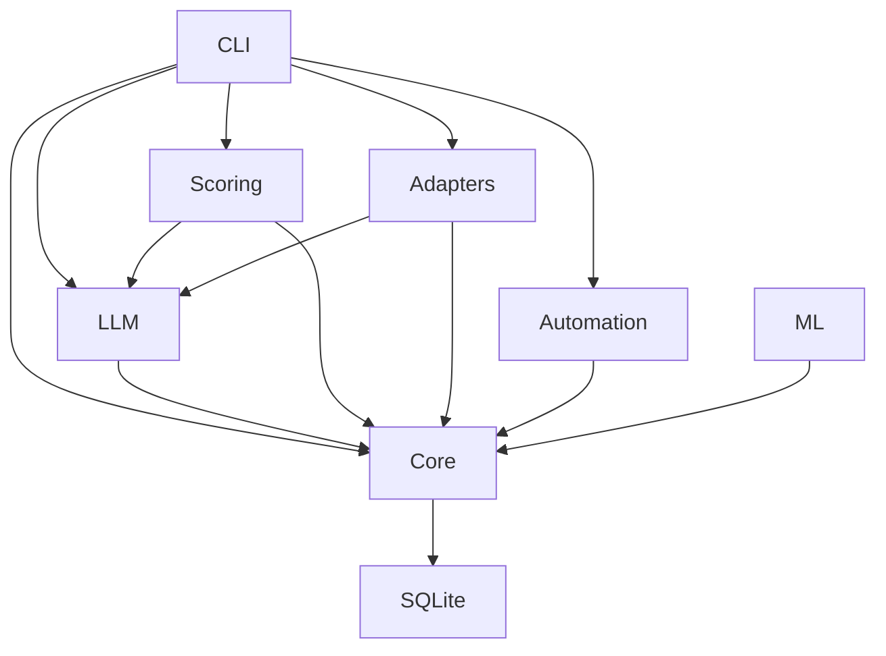

# Contributing Guide

Thank you for your interest in contributing to Agentic Neural Career Surface Optimizer! We welcome contributions from the community.

## Code of Conduct

By participating in this project, you agree to abide by our [Code of Conduct](CODE_OF_CONDUCT.md).

## How to Contribute

### Reporting Issues

- Use GitHub Issues to report bugs or suggest features
- Include clear reproduction steps for bugs
- Provide context about your environment (OS, Node version, etc.)

### Development Setup

```bash
# Clone the repository
git clone https://github.com/your-repo/agentic-neural-career-optimizer.git
cd agentic-neural-career-optimizer

# Install dependencies
pnpm install

# Set up environment
cp .env.example .env
# Edit .env with your API keys

# Run the doctor command to verify setup
pnpm run doctor
```

### Development Workflow

1. **Create a branch**: `git checkout -b feature/your-feature-name`
2. **Make changes**: Implement your feature or bug fix
3. **Run tests**: `pnpm run test`
4. **Run linter**: `pnpm run lint`
5. **Commit changes**: Follow commit message conventions
6. **Push branch**: `git push origin feature/your-feature-name`
7. **Create PR**: Open a Pull Request on GitHub

### Commit Message Conventions

We follow conventional commits:
- `feat`: New feature
- `fix`: Bug fix
- `docs`: Documentation changes
- `style`: Code style changes (formatting, missing semicolons)
- `refactor`: Code refactoring (no functional changes)
- `perf`: Performance improvements
- `test`: Adding or updating tests
- `chore`: Build process or auxiliary tool changes

Examples:
- `feat(llm): add new prompt template for resume generation`
- `fix(github): handle OAuth token refresh properly`
- `docs: update README with new CLI commands`

### Code Style

- **TypeScript**: Strict typing, interfaces for complex objects
- **Formatting**: Prettier for consistent formatting
- **Linting**: ESLint with TypeScript support
- **Naming**: camelCase for variables, PascalCase for types/interfaces
- **Comments**: JSDoc for public APIs, inline comments for complex logic

### Testing

- **Unit Tests**: For core logic, utilities, and pure functions
- **Integration Tests**: For package interactions and API clients
- **E2E Tests**: For CLI commands and automation flows
- **Mocking**: Use mocks for external services in tests

Run tests:
```bash
pnpm run test
```

Run tests with coverage:
```bash
pnpm run test:coverage
```

### Documentation

- Update documentation for any new features
- Add examples where helpful
- Keep API documentation up to date
- Update architecture diagrams if structural changes

### Pull Request Process

1. Ensure all tests pass
2. Ensure linting passes
3. Update documentation if needed
4. Include a clear description of changes
5. Reference any related issues
6. Be responsive to review feedback

## Architecture Guidelines

### Package Structure

- **Core**: Foundation layer, minimal dependencies
- **LLM**: OpenRouter integration, prompt management
- **Scoring**: Rubrics, validation, diff engine
- **Adapters**: Platform-specific integrations
- **Automation**: Browser automation logic
- **ML**: Embeddings and ranker scaffold

### Dependency Rules



### Key Principles

1. **Local-first**: No cloud dependencies, all data local
2. **Safety-first**: Manual login, run approval, stop-before-submit
3. **Modular**: Clear separation of concerns
4. **Extensible**: Pluggable architecture
5. **Type-safe**: Strict TypeScript throughout

## Security Considerations

- Never commit API keys or sensitive data
- Follow security checklist in SECURITY.md
- Sanitize all inputs and outputs
- Respect platform rate limits
- Handle errors gracefully without data leakage

## Getting Help

- Check existing issues and discussions
- Review documentation in docs/
- Ask questions by opening a discussion
- Join our community (link to be added)

## Recognition

We appreciate all contributions! Contributors will be recognized in:
- GitHub contributors list
- Release notes
- Project documentation

Thank you for helping make Agentic Neural Career Surface Optimizer better!